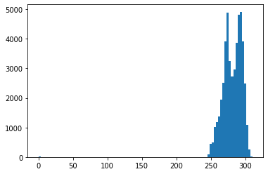
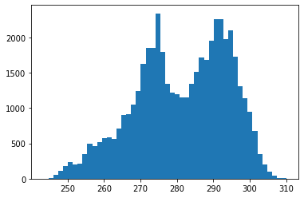
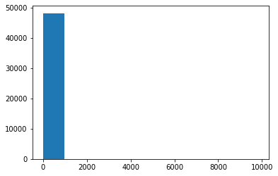
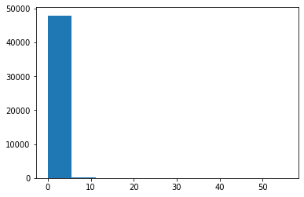
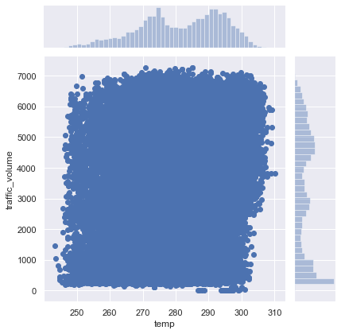
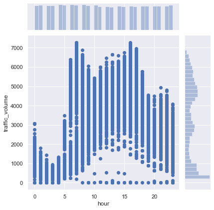
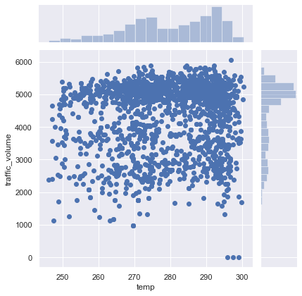

# Machine Learning Project

## Predict traffic volume

Using the "Metro Interstate Traffic Volume" public dataset from the UCI repository (source: http://archive.ics.uci.edu/ml/datasets/Metro+Interstate+Traffic+Volume)

This data contains 48204 instances of hourly interstate 94 Westbound traffic volume for MN DoT ATR station 301, roughly midway between Minneapolis and St Paul, MN. Hourly weather features and holidays included for impacts on traffic volume. Attributes include:

   1. Holiday (holiday): Categorical US National holidays plus regional holiday, Minnesota State Fair (nominal)  
   2. Temperature (temp): Numeric Average in kelvin (numerical)
   3. Rain (rain_1h): Numeric Amount in mm of rain that occurred in the hour (numerical)
   4. Snow (snow_1h): Numeric Amount in mm of snow that occurred in the hour (numerical)
   5. Clouds (clouds_all): Numeric Percentage of cloud cover (numerical)
   6. Weather Main: weather_main Categorical Short textual description of the current weather (ordinal)
   7. Weather Description (weather_description): Categorical Longer textual description of the current weather (ordinal)
   8. Date & Time (date_time): DateTime Hour of the data collected in local CST time
   9. Traffic Volume (traffic_volume) Numeric Hourly I-94 ATR 301 reported westbound traffic volume

   
The Holiday attribute needs to be polished. In the dataset, only at 0:00:00 row of the holiday is labelled. Holiday should be effective through out the 24 rows, adjustment is required.

"Weather Main" and "Weather Description" are highly similar, it appears that the latter breaks the weather data into more specific classes, which I believe is more than sufficient in this usage, hence the column will be dropped.


## Scope of Project

Practice applying several different supervised machine learning techniques to this data set, and see which one yields the highest accuracy as measured with K-Fold cross validation (K=10). Apply:

* Decision tree
* Random forest
* KNN
* Naive Bayes
* SVM
* Logistic Regression
* a neural network using Keras.

## Data preparation

Start by importing the dataset file into a Pandas dataframe.


```python
%matplotlib inline
import numpy as np
import pandas as pd

#Read data file
df = pd.read_csv("Metro_Interstate_Traffic_Volume.csv")
df.head(10)
```


<div>
<style scoped>
    .dataframe tbody tr th:only-of-type {
        vertical-align: middle;
    }

    .dataframe tbody tr th {
        vertical-align: top;
    }

    .dataframe thead th {
        text-align: right;
    }
</style>
<table border="1" class="dataframe">
  <thead>
    <tr style="text-align: right;">
      <th></th>
      <th>holiday</th>
      <th>temp</th>
      <th>rain_1h</th>
      <th>snow_1h</th>
      <th>clouds_all</th>
      <th>weather_main</th>
      <th>weather_description</th>
      <th>date_time</th>
      <th>traffic_volume</th>
    </tr>
  </thead>
  <tbody>
    <tr>
      <th>0</th>
      <td>None</td>
      <td>288.28</td>
      <td>0.0</td>
      <td>0.0</td>
      <td>40</td>
      <td>Clouds</td>
      <td>scattered clouds</td>
      <td>2012-10-02 09:00:00</td>
      <td>5545</td>
    </tr>
    <tr>
      <th>1</th>
      <td>None</td>
      <td>289.36</td>
      <td>0.0</td>
      <td>0.0</td>
      <td>75</td>
      <td>Clouds</td>
      <td>broken clouds</td>
      <td>2012-10-02 10:00:00</td>
      <td>4516</td>
    </tr>
    <tr>
      <th>2</th>
      <td>None</td>
      <td>289.58</td>
      <td>0.0</td>
      <td>0.0</td>
      <td>90</td>
      <td>Clouds</td>
      <td>overcast clouds</td>
      <td>2012-10-02 11:00:00</td>
      <td>4767</td>
    </tr>
    <tr>
      <th>3</th>
      <td>None</td>
      <td>290.13</td>
      <td>0.0</td>
      <td>0.0</td>
      <td>90</td>
      <td>Clouds</td>
      <td>overcast clouds</td>
      <td>2012-10-02 12:00:00</td>
      <td>5026</td>
    </tr>
    <tr>
      <th>4</th>
      <td>None</td>
      <td>291.14</td>
      <td>0.0</td>
      <td>0.0</td>
      <td>75</td>
      <td>Clouds</td>
      <td>broken clouds</td>
      <td>2012-10-02 13:00:00</td>
      <td>4918</td>
    </tr>
    <tr>
      <th>5</th>
      <td>None</td>
      <td>291.72</td>
      <td>0.0</td>
      <td>0.0</td>
      <td>1</td>
      <td>Clear</td>
      <td>sky is clear</td>
      <td>2012-10-02 14:00:00</td>
      <td>5181</td>
    </tr>
    <tr>
      <th>6</th>
      <td>None</td>
      <td>293.17</td>
      <td>0.0</td>
      <td>0.0</td>
      <td>1</td>
      <td>Clear</td>
      <td>sky is clear</td>
      <td>2012-10-02 15:00:00</td>
      <td>5584</td>
    </tr>
    <tr>
      <th>7</th>
      <td>None</td>
      <td>293.86</td>
      <td>0.0</td>
      <td>0.0</td>
      <td>1</td>
      <td>Clear</td>
      <td>sky is clear</td>
      <td>2012-10-02 16:00:00</td>
      <td>6015</td>
    </tr>
    <tr>
      <th>8</th>
      <td>None</td>
      <td>294.14</td>
      <td>0.0</td>
      <td>0.0</td>
      <td>20</td>
      <td>Clouds</td>
      <td>few clouds</td>
      <td>2012-10-02 17:00:00</td>
      <td>5791</td>
    </tr>
    <tr>
      <th>9</th>
      <td>None</td>
      <td>293.10</td>
      <td>0.0</td>
      <td>0.0</td>
      <td>20</td>
      <td>Clouds</td>
      <td>few clouds</td>
      <td>2012-10-02 18:00:00</td>
      <td>4770</td>
    </tr>
  </tbody>
</table>
</div>


#### "Holiday" and "Date_time" column are not ready

Note that the data type of 'date_time' is a Pandas 'series' class, which is not ideal to work with.


```python
print(type(df['date_time']))
```

    <class 'pandas.core.series.Series'>
    

Let's expand the date_time string into timestamp format, and store the individual date and time components into the dateset.

While we loop through the data to do so, convert the holiday from string to index (integer).

The nominal references are stored in a dictionary (with unique entries).


```python
import datetime

# Make a unique dictionary
holiday_dict = {}

# n is a counting variable to stores the last new index
n = 1
# holiday_idx is the actual index variable for a holiday, new or reoccurring
holiday_idx = 0

# Loop through the data and modify
print("----- Converting Holiday name strings to index integer... ---------- ")
for x,y in df.iterrows():
    # Convert string date_time into a timestamp data
    now = datetime.datetime.strptime(y['date_time'], '%Y-%m-%d %H:%M:%S')
    
    # append time data column to the dataframe
    df.at[x, 'year'] = now.year
    df.at[x, 'month'] = now.month
    df.at[x, 'day'] = now.day
    df.at[x, 'hour'] = now.hour
    
    # if this row has not been converted to index
    if(type(df.at[x,'holiday']) != int):
        # get the string
        holiday_str = y['holiday']
        
        # if this row is at mid-night
        if(now.hour == 0):
            # this row should decide for following rows, for the rest of the day
            # if today is not a hoilday
            if(holiday_str == 'None'):
                # index should be zero
                holiday_idx = 0 
            # otherwise if today is a holiday
            else:
                # do different things depending on whether this holiday 
                # is already in the dictionary or not
                # if this holiday is not in data yet
                if holiday_str not in holiday_dict.keys():
                    # add to the dictionary
                    holiday_dict[holiday_str] = n
                    # pass the new index value for later to assign
                    holiday_idx = n
                    # increase the last new index count
                    n += 1
                    
                # if this holiday is already in data    
                else:
                    holiday_idx = holiday_dict[holiday_str];
                
                # this is a convertion that just happened, print to confirm
                print(y['holiday'], "->", holiday_idx, " : ", y['date_time'])

        # Update the holiday column data with "today"'s holiday index
        # recall that holiday_idx by default is 0 ("None")
        # every mid-night from the loop above would update "today"'s holiday index
        df.at[x, 'holiday'] = np.float64(holiday_idx)
        
        

df['year'] = df['year'].astype(np.int64)
df['month'] = df['month'].astype(np.int64)
df['day'] = df['day'].astype(np.int64)
df['hour'] = df['hour'].astype(np.int64)
        
print("----- ... Done ----- ")
```

    ----- Converting Holiday name strings to index integer... ---------- 
    Columbus Day -> 1  :  2012-10-08 00:00:00
    Veterans Day -> 2  :  2012-11-12 00:00:00
    Thanksgiving Day -> 3  :  2012-11-22 00:00:00
    Christmas Day -> 4  :  2012-12-25 00:00:00
    New Years Day -> 5  :  2013-01-01 00:00:00
    Washingtons Birthday -> 6  :  2013-02-18 00:00:00
    Memorial Day -> 7  :  2013-05-27 00:00:00
    Independence Day -> 8  :  2013-07-04 00:00:00
    State Fair -> 9  :  2013-08-22 00:00:00
    Labor Day -> 10  :  2013-09-02 00:00:00
    Columbus Day -> 1  :  2013-10-14 00:00:00
    Veterans Day -> 2  :  2013-11-11 00:00:00
    Thanksgiving Day -> 3  :  2013-11-28 00:00:00
    Christmas Day -> 4  :  2013-12-25 00:00:00
    New Years Day -> 5  :  2014-01-01 00:00:00
    Martin Luther King Jr Day -> 11  :  2014-01-20 00:00:00
    Washingtons Birthday -> 6  :  2014-02-17 00:00:00
    Memorial Day -> 7  :  2014-05-26 00:00:00
    Independence Day -> 8  :  2015-07-03 00:00:00
    State Fair -> 9  :  2015-08-27 00:00:00
    Labor Day -> 10  :  2015-09-07 00:00:00
    Columbus Day -> 1  :  2015-10-12 00:00:00
    Veterans Day -> 2  :  2015-11-11 00:00:00
    Thanksgiving Day -> 3  :  2015-11-26 00:00:00
    Thanksgiving Day -> 3  :  2015-11-26 00:00:00
    Christmas Day -> 4  :  2015-12-25 00:00:00
    New Years Day -> 5  :  2016-01-01 00:00:00
    New Years Day -> 5  :  2016-01-01 00:00:00
    Washingtons Birthday -> 6  :  2016-02-15 00:00:00
    Memorial Day -> 7  :  2016-05-30 00:00:00
    Independence Day -> 8  :  2016-07-04 00:00:00
    State Fair -> 9  :  2016-08-25 00:00:00
    Labor Day -> 10  :  2016-09-05 00:00:00
    Labor Day -> 10  :  2016-09-05 00:00:00
    Columbus Day -> 1  :  2016-10-10 00:00:00
    Veterans Day -> 2  :  2016-11-11 00:00:00
    Thanksgiving Day -> 3  :  2016-11-24 00:00:00
    Christmas Day -> 4  :  2016-12-26 00:00:00
    Christmas Day -> 4  :  2016-12-26 00:00:00
    New Years Day -> 5  :  2017-01-02 00:00:00
    Martin Luther King Jr Day -> 11  :  2017-01-16 00:00:00
    Martin Luther King Jr Day -> 11  :  2017-01-16 00:00:00
    Washingtons Birthday -> 6  :  2017-02-20 00:00:00
    Memorial Day -> 7  :  2017-05-29 00:00:00
    Independence Day -> 8  :  2017-07-04 00:00:00
    State Fair -> 9  :  2017-08-24 00:00:00
    Labor Day -> 10  :  2017-09-04 00:00:00
    Columbus Day -> 1  :  2017-10-09 00:00:00
    Veterans Day -> 2  :  2017-11-10 00:00:00
    Thanksgiving Day -> 3  :  2017-11-23 00:00:00
    Christmas Day -> 4  :  2017-12-25 00:00:00
    New Years Day -> 5  :  2018-01-01 00:00:00
    Martin Luther King Jr Day -> 11  :  2018-01-15 00:00:00
    Martin Luther King Jr Day -> 11  :  2018-01-15 00:00:00
    Martin Luther King Jr Day -> 11  :  2018-01-15 00:00:00
    Washingtons Birthday -> 6  :  2018-02-19 00:00:00
    Memorial Day -> 7  :  2018-05-28 00:00:00
    Independence Day -> 8  :  2018-07-04 00:00:00
    State Fair -> 9  :  2018-08-23 00:00:00
    Labor Day -> 10  :  2018-09-03 00:00:00
    Labor Day -> 10  :  2018-09-03 00:00:00
    ----- ... Done ----- 
    

Notice that some entries have duplicate date time. It is uncertain whether those rows are duplicate entries (with other columns having various data) or only the timestamp is incorrect. Some hours are missing, too. However, for now let's proceed without making any counter measure to those error.

Now apply the same index conversion to the "weather_main" column.


```python
# Make a unique dictionary
weather_dict = {}

# n is a counting variable to stores the last new index
n = 1
# weather_idx is the actual index variable for a weather condition, new or reoccurring
weather_idx = 0

# Loop through the data and modify
print("----- Converting Weather strings to index integer... ---------- ")
for x,y in df.iterrows():
  
 
    # if this row has not been converted to index
    if(type(df.at[x,'weather_main']) != int):
        # get the string
        weather_str = y['weather_main']
        
      
        # if weather is clear
        if(weather_str == 'Clear'):
            # index should be zero
            weather_idx = 0 
        # otherwise 
        else:
            # do different things depending on whether this weather condition 
            # is already in the dictionary or not
            # if this weather condition is not in data yet
            if weather_str not in weather_dict.keys():
                # add to the dictionary
                weather_dict[weather_str] = n
                # pass the new index value for later to assign
                weather_idx = n
                # increase the last new index count
                n += 1
                # this is a new condition that was added to the record, print to confirm
                print(y['weather_main'], "->", weather_idx, " : ", y['date_time'])
                
            # if this weather is already in data    
            else:
                weather_idx = weather_dict[weather_str];

            

        # Update the weather column data with the current weather index
        # recall that weather_idx by default is 0 ("Clear")
        # every hour would update
        df.at[x, 'weather_main'] = np.float64(weather_idx)
        
        


print("----- ... Done ----- ")
```

    ----- Converting Weather strings to index integer... ---------- 
    Clouds -> 1  :  2012-10-02 09:00:00
    Rain -> 2  :  2012-10-09 15:00:00
    Drizzle -> 3  :  2012-10-10 07:00:00
    Mist -> 4  :  2012-10-14 08:00:00
    Haze -> 5  :  2012-10-14 09:00:00
    Fog -> 6  :  2012-10-14 23:00:00
    Thunderstorm -> 7  :  2012-10-23 15:00:00
    Snow -> 8  :  2012-10-26 09:00:00
    Squall -> 9  :  2013-05-12 02:00:00
    Smoke -> 10  :  2015-07-06 13:00:00
    ----- ... Done ----- 
    

Take a look at the brief summary of our data. 


```python
df_des = df.describe()
print(df_des)
```

                   temp       rain_1h       snow_1h    clouds_all  traffic_volume  \
    count  48204.000000  48204.000000  48204.000000  48204.000000    48204.000000   
    mean     281.205870      0.334264      0.000222     49.362231     3259.818355   
    std       13.338232     44.789133      0.008168     39.015750     1986.860670   
    min        0.000000      0.000000      0.000000      0.000000        0.000000   
    25%      272.160000      0.000000      0.000000      1.000000     1193.000000   
    50%      282.450000      0.000000      0.000000     64.000000     3380.000000   
    75%      291.806000      0.000000      0.000000     90.000000     4933.000000   
    max      310.070000   9831.300000      0.510000    100.000000     7280.000000   
    
                   year         month           day          hour  
    count  48204.000000  48204.000000  48204.000000  48204.000000  
    mean    2015.512426      6.506037     15.737636     11.398162  
    std        1.893211      3.400221      8.722938      6.940238  
    min     2012.000000      1.000000      1.000000      0.000000  
    25%     2014.000000      4.000000      8.000000      5.000000  
    50%     2016.000000      7.000000     16.000000     11.000000  
    75%     2017.000000      9.000000     23.000000     17.000000  
    max     2018.000000     12.000000     31.000000     23.000000  
    

It appears that the count is equal for all columns, likely no missing data exist. But in the case where it does, the following code would drop all the rows with NaN.


```python
# drop all NaN rows
#df = df.dropna()
```

In the case of the dataset file containing other specific marking as null indicator, then use the following code to load the data again, where, in this example, converts all "?" cells to NaN.  


```python
#df = pd.read_csv("Metro_Interstate_Traffic_Volume.csv", na_values = "?", na_filter = True)
```

Next, there seems to be some errornous data to take care of.

Temperature for example, the first clue is that there a min value of "0". That is -273 in Celcius, or -456 in Fahrenheit, which does not sound reasonable. 

For a further investigation, we can check with the historgram plot.


```python
import matplotlib.pyplot as plt
col = df['temp']
plt.hist(df['temp'],100)
plt.show()
```





We can see better if the plot exclude a certain out-ranged data. The following is a code that generally works for excluding outliers for plotting:


```python
# Take in data column and returns out that filters out +/- 4 deviation (unless give specific upper and lower bound)
def reject_outliers(data_col, lower_bound = 0, upper_bound = 0):
    u = np.nanmedian(data_col)
    s = np.std(data_col)
    if not lower_bound:
        lower_bound = u - 4 * s     
    if not upper_bound:
        upper_bound = u + 4 * s
        
    filtered = [e for e in data_col if (lower_bound < e < upper_bound)]
    
    return filtered
```

Let's check the plot again...


```python
filtered_col = reject_outliers(col)

plt.hist(filtered_col, 50)
plt.show()
```





Here we clearly see the outlier entry has been skewing the dataset. Such data should be excluded. 

Before we apply modification to the temperature column, let's also check other numeric data for outliers.

Rain has an unsual max value, so let's take a close look.


```python
col = df['rain_1h']
plt.hist(col,10)
plt.show()
```





Sure enough, there is some strong outlier stretching mean. 

9000 mm per hour is unrealistic. Extreme weather in the U.S can possibly go up to 1800 per hour (https://www.cnn.com/travel/article/extreme-weather-records/index.html), but according to Wikipedia, a "Violent Rain" is ">50 mm per hour" (https://en.wikipedia.org/wiki/Rain). In our dataset, other 2nd greatest rain in record is 55 mm.

With the outlier data pulling up the standard deviation of the column, we cannot simply rely on the filtering function's standard filtering (because std = 44).   

We can constrain with a reasonable range of 0.00 to 60.00.


```python
filtered_col = reject_outliers(col,0,60)

plt.hist(filtered_col,10)
plt.show()
```





Cannot see the data clearly, since the majority of data are clustered between 0 to 5. However, the errorouns data is certainly discarded here.

Although rain and snow columns still have rare and extreme cases being the "outlier", these data are meaningful. Traffic volume may response significantly to these rare cases. If this ML product is to be developed into an anomaly detection, these outlier data should be evaluated (assuming this does not cause problem to the learning models).

Other numeric columns seems fine. Now we actually remove those rows from the dataset.


```python
df = df.drop(df[(df.temp < 220)].index)
df = df.drop(df[df.rain_1h > 60].index)
```


```python
df_des = df.describe()
print(df_des)
```

                   temp       rain_1h       snow_1h    clouds_all  traffic_volume  \
    count  48193.000000  48193.000000  48193.000000  48193.000000    48193.000000   
    mean     281.263786      0.130342      0.000222     49.371942     3260.174029   
    std       12.709364      1.003480      0.008169     39.013548     1986.754010   
    min      243.390000      0.000000      0.000000      0.000000        0.000000   
    25%      272.180000      0.000000      0.000000      1.000000     1194.000000   
    50%      282.460000      0.000000      0.000000     64.000000     3380.000000   
    75%      291.810000      0.000000      0.000000     90.000000     4933.000000   
    max      310.070000     55.630000      0.510000    100.000000     7280.000000   
    
                   year         month           day          hour  
    count  48193.000000  48193.000000  48193.000000  48193.000000  
    mean    2015.512730      6.507045     15.738178     11.399353  
    std        1.893301      3.399867      8.721451      6.940353  
    min     2012.000000      1.000000      1.000000      0.000000  
    25%     2014.000000      4.000000      8.000000      5.000000  
    50%     2016.000000      7.000000     16.000000     11.000000  
    75%     2017.000000      9.000000     23.000000     17.000000  
    max     2018.000000     12.000000     31.000000     23.000000  
    

The data seems cleaned up now. Moving on...


## Data Analysis / Discussion

We have no clear idea how the features are influencing the traffic volume. 

Seaborn allows us to visualize data to understand what we're dealing with. 

For example, take a look at the relationship between temperature and traffic volume data.


```python
import seaborn as sns
sns.set()
sns.jointplot(x="temp", y="traffic_volume", data=df)
```


    <seaborn.axisgrid.JointGrid at 0x1a0156a7be0>





This does not seem useful at all. The data are rather evenly distributed. Does this imply that no matter how hot or cold the temperature is, that the traffic may vary between 0 to 7800 without bias? From real life observation, the answer is intuitively "No". So is there something wrong with the dataset?

Now take a look at the relationship bewteen hour and traffic.


```python
sns.set()
sns.jointplot(x="hour", y="traffic_volume", data=df)
```


    <seaborn.axisgrid.JointGrid at 0x1a0190d3da0>





What we see here is a general pattern that there are quiet hours and busy hours. 

Ofcourse, there are data showing that the hottest and the coldest days, there are late night hour blocks where traffic is very low, and also busy hours in the day. 

What if we only compare data from at 9:00 am rush hour?


```python
df2 = df.where(df['hour'] == 9)
sns.set()
sns.jointplot(x="temp", y="traffic_volume", data=df2)
```


    <seaborn.axisgrid.JointGrid at 0x1a0192985c0>





Here we start to see some pattern, making the data meaningful.

Note that this pattern reflects only at the 9 to 10 am block. We do not know and should not assume that all the other hour blocks have the same human behavior tendency towards temperature. 

Some of the other features are also only meaningful when comparing hour-to-hour. But how should we plug the hour factor into the dataset in order for the machine to learn properly? I have a few abstracts in mind, but I do not have the experience to tackle that problem. Hence, I will move on disregarding it. (Will come back to that in future)

## Classification Problem

Traffic volume is currently an integer value ranging from 0 to 7280. We do not need the machine to predict the exact traffic volume quantity, we just need to know if its clear, light, moderate, or heavy.  Hence, let's break down the traffic volume into 4 classes. The method I choose to classify is a simple method (dividing by 2000), but there are many other ways to classify the grades of traffic weight. 


```python
# Convert traffic volume into category 0, 1, 2, 3
df['traffic_volume'] = np.divide(df['traffic_volume'], 2000)
df['traffic_volume'] = df['traffic_volume'].astype('int64')
print ("Done!")
```

    Done!
    

## Features and Targets data

After cleaning up the rows, we can select only the columns that we do need as our feature set.

Split the dataset into two, one is for the learning features (input), one is for the target variables (prediction outcome).


```python
# A list of features (columns) from the dataset
feature_list = ['holiday','temp', 'rain_1h', 'snow_1h', 'clouds_all', 'weather_main', 'hour']

# The ML will learn that these factors...
features = df[feature_list].values
print ('Features:\n', feature_list)
print (features[:10])

# ... cause these outcomes
targets = df['traffic_volume'].values 
print ('\nTargets:\n[traffic_volume]',)
print (targets[:10])
```

    Features:
     ['holiday', 'temp', 'rain_1h', 'snow_1h', 'clouds_all', 'weather_main', 'hour']
    [[0.0 288.28 0.0 0.0 40 1.0 9]
     [0.0 289.36 0.0 0.0 75 1.0 10]
     [0.0 289.58 0.0 0.0 90 1.0 11]
     [0.0 290.13 0.0 0.0 90 1.0 12]
     [0.0 291.14 0.0 0.0 75 1.0 13]
     [0.0 291.72 0.0 0.0 1 0.0 14]
     [0.0 293.17 0.0 0.0 1 0.0 15]
     [0.0 293.86 0.0 0.0 1 0.0 16]
     [0.0 294.14 0.0 0.0 20 1.0 17]
     [0.0 293.1 0.0 0.0 20 1.0 18]]
    
    Targets:
    [traffic_volume]
    [2 2 2 2 2 2 2 3 2 2]
    

# Training Models

Some of the models require the input data to be normalized. We will now normalize the attribute data, using preprocessing.StandardScaler().


```python
from sklearn.preprocessing import StandardScaler

# Scale the model with StandardScaler
scaler = StandardScaler()

# Check results
scaled_features = scaler.fit_transform(features)
print ('Features:\n', feature_list)
print(scaled_features[:10])
```

    Features:
     ['holiday', 'temp', 'rain_1h', 'snow_1h', 'clouds_all', 'weather_main', 'hour']
    [[-0.15913356  0.55205645 -0.12989104 -0.02723145 -0.24022525 -0.45678703
      -0.34571406]
     [-0.15913356  0.63703405 -0.12989104 -0.02723145  0.65690832 -0.45678703
      -0.20162767]
     [-0.15913356  0.6543443  -0.12989104 -0.02723145  1.04139413 -0.45678703
      -0.05754128]
     [-0.15913356  0.69761993 -0.12989104 -0.02723145  1.04139413 -0.45678703
       0.08654512]
     [-0.15913356  0.77708972 -0.12989104 -0.02723145  0.65690832 -0.45678703
       0.23063151]
     [-0.15913356  0.82272583 -0.12989104 -0.02723145 -1.23988837 -0.89417899
       0.37471791]
     [-0.15913356  0.93681613 -0.12989104 -0.02723145 -1.23988837 -0.89417899
       0.5188043 ]
     [-0.15913356  0.99110737 -0.12989104 -0.02723145 -1.23988837 -0.89417899
       0.66289069]
     [-0.15913356  1.0131386  -0.12989104 -0.02723145 -0.752873   -0.45678703
       0.80697709]
     [-0.15913356  0.93130832 -0.12989104 -0.02723145 -0.752873   -0.45678703
       0.95106348]]
    

## Split up Training and Testing data

Before moving to K-Fold cross validation and random forests, start by creating a single train/test split of our data. Set aside 75% for training, and 25% for testing.


```python
import numpy
from sklearn.model_selection import train_test_split

numpy.random.seed(54321)

X_train, X_test, y_train, y_test = train_test_split(scaled_features, targets, train_size=0.75, random_state=77777)
```

Now it is ready to fit the training data into various models.


```python
# Scoreboard to keep track of each model's score
score_dict = {}
```

## Decision Tree


```python
from sklearn.tree import DecisionTreeClassifier
clf = DecisionTreeClassifier(random_state=1)
clf = clf.fit(X_train,y_train)

score_dict['Tree Decision Classifier'] = clf.score(X_test, y_test)
print (score_dict['Tree Decision Classifier'])
```

    0.7713503195285916
    

Now instead of a single train/test split, use K-Fold cross validation to get a better measure of your model's accuracy (K=30). 


```python
from sklearn.model_selection import cross_val_score
# We give cross_val_score a model, the entire data set and its "real" values, and the number of folds:
scores = cross_val_score(clf, X_test, y_test, cv=30)

# Print the accuracy for each fold:
print(scores)

# And the mean accuracy of all 30 folds:
print(scores.mean())

score_dict['K-Fold Cross Validation'] = scores.mean()
```

    [0.74689826 0.77915633 0.74937965 0.7369727  0.75434243 0.70471464
     0.69727047 0.73449132 0.7146402  0.75682382 0.74689826 0.74193548
     0.7617866  0.72952854 0.73945409 0.75124378 0.75621891 0.78054863
     0.74314214 0.72319202 0.7755611  0.735      0.73       0.7375
     0.75       0.75       0.73433584 0.78195489 0.71929825 0.73684211]
    0.7433043486168647
    

## Random Forest


```python
from sklearn.ensemble import RandomForestClassifier

clf2 = RandomForestClassifier(n_estimators=30)
clf2 = clf2.fit(X_train,y_train)

scores2 = cross_val_score(clf2, X_test, y_test, cv=30)

# Print the accuracy for each fold:
print('Accuracy for each fold:')
print(scores2)

# And the mean accuracy of all 30 folds:
print('\nThe mean accuracy of all 30 folds')
print(scores2.mean())

score_dict['Random Forest Classifier'] = scores2.mean()
```

    Accuracy for each fold:
    [0.79156328 0.76426799 0.75682382 0.76674938 0.78411911 0.72456576
     0.71712159 0.74193548 0.73449132 0.77419355 0.76923077 0.74441687
     0.78411911 0.75930521 0.75186104 0.75124378 0.77860697 0.78054863
     0.74314214 0.72069825 0.7755611  0.765      0.7475     0.7425
     0.765      0.735      0.73433584 0.78446115 0.75689223 0.76190476]
    
    The mean accuracy of all 30 folds
    0.7569053041303139
    

## SVM
svm.SVC with a linear kernel


```python
from sklearn import svm

C = 1.0
svc = svm.SVC(kernel='linear', C=C)

cv_scores = cross_val_score(svc, X_train, y_train, cv=10)

print(cv_scores)

score_dict['SVM.SVC'] = cv_scores.mean()
```

    [0.68196903 0.68141593 0.68832965 0.67643805 0.68298755 0.67985612
     0.6900083  0.6900083  0.67755328 0.67829457]
    


```python
print (cv_scores.mean())
```

    0.6826860782006697
    

## KNN
K-Nearest-Neighbors


```python
from sklearn.neighbors import KNeighborsClassifier
neigh = KNeighborsClassifier(n_neighbors=10)
neigh.fit(X_train, y_train)

print(neigh.score(X_test, y_test))
```

    0.7693584529836501
    

Choosing K is tricky, so we can't discard KNN until we've tried different values of K. Here's a for loop to run KNN with K values ranging from 1 to 50 and see if K makes a substantial difference. 


```python
max_score = 0
best_K = 1
for K in range(1,51):
    neigh = KNeighborsClassifier(n_neighbors=K)
    neigh.fit(X_train, y_train)    
    score = neigh.score(X_test, y_test)
    if (score > max_score):
        max_score = score
        best_K = K

print("Best outcome: K=", best_K, ": ", max_score)
score_dict['K-Nearest-Neighbors'] = max_score
```

    Best outcome: K= 11 :  0.7696904307411403
    

## Naive Bayes

Now try naive_bayes.MultinomialNB.


```python
from sklearn.preprocessing import MinMaxScaler

scaler = MinMaxScaler()
scaled_X_train = scaler.fit_transform(X_train)
scaled_X_test = scaler.transform(X_test)


from sklearn.naive_bayes import MultinomialNB
classifier = MultinomialNB()

classifier.fit(scaled_X_train, y_train)

print(classifier.score(scaled_X_test, y_test))

score_dict['Naive Bayes'] = classifier.score(scaled_X_test, y_test)

```

    0.42667441281434143
    

## Revisiting SVM

svm.SVC may perform differently with different kernels. Try the rbf and poly kernels and see what the best-performing kernel is.


```python
svc = svm.SVC(C=1.0, decision_function_shape='ovo', degree=3, gamma='scale', kernel='rbf', max_iter=-1, probability=False, random_state=None, 
tol=0.001, verbose=False).fit(scaled_X_train, y_train)

print(svc.score(scaled_X_test, y_test))

score_dict['SVM with RBF kernel'] = svc.score(scaled_X_test, y_test)
```

    0.7401444103245083
    


```python
svc = svm.SVC(C=1.0, decision_function_shape='ovo', degree=3, gamma='scale', kernel='poly', max_iter=-1, probability=False, random_state=None, 
tol=0.001, verbose=False).fit(scaled_X_train, y_train)

print(svc.score(scaled_X_test, y_test))
score_dict['SVM with Poly kernel'] = svc.score(scaled_X_test, y_test)
```

    0.6544941488920243
    

## Logistic Regression

We've tried all these fancy techniques, but fundamentally this is just a binary classification problem. Try Logisitic Regression, which is a simple way to tackling this sort of thing.


```python
from sklearn.linear_model import LogisticRegression
logistic_clf = LogisticRegression(penalty = 'l2', dual=False, C=1.0, fit_intercept=False, intercept_scaling=1, random_state=None, solver='lbfgs', max_iter=1000, multi_class='multinomial', verbose=0, warm_start=False, n_jobs=None, l1_ratio=None).fit(scaled_X_train, y_train)
print(logistic_clf.score(scaled_X_test, y_test))    

score_dict['Logistic Regression'] = logistic_clf.score(scaled_X_test, y_test)
```

    0.5998838077848784
    

## Neural Networks
Using Keras to set up a neural network

Start with importing modules.


```python
from tensorflow import keras
from tensorflow.keras.datasets import mnist
from tensorflow.keras.models import Sequential
from tensorflow.keras.layers import Dense, Dropout
from tensorflow.keras.optimizers import RMSprop
```

Setting up session, configuring GPU.


```python
import tensorflow as tf
from tensorflow.keras.backend import set_session
config = tf.ConfigProto()
config.gpu_options.allow_growth = True  # dynamically grow the memory used on the GPU
sess = tf.Session(config=config)
set_session(sess)  # set this TensorFlow session as the default session for Keras
```

Setting the model's layers.


```python
model = Sequential()
model.add(Dense(7, activation='relu', input_shape=(7,)))
model.add(Dense(7, activation='relu'))
model.add(Dense(4, activation='softmax'))
```

    WARNING:tensorflow:From D:\Users\ichig\Anaconda3\lib\site-packages\tensorflow\python\ops\resource_variable_ops.py:435: colocate_with (from tensorflow.python.framework.ops) is deprecated and will be removed in a future version.
    Instructions for updating:
    Colocations handled automatically by placer.
    


```python
model.summary()
```

    _________________________________________________________________
    Layer (type)                 Output Shape              Param #   
    =================================================================
    dense (Dense)                (None, 7)                 56        
    _________________________________________________________________
    dense_1 (Dense)              (None, 7)                 56        
    _________________________________________________________________
    dense_2 (Dense)              (None, 4)                 32        
    =================================================================
    Total params: 144
    Trainable params: 144
    Non-trainable params: 0
    _________________________________________________________________
    

Here we go.


```python
model.compile(loss='sparse_categorical_crossentropy',
              optimizer='Adam',
              metrics=['accuracy'])
```


```python
history = model.fit(scaled_X_train, y_train,
                    batch_size=10,
                    epochs=50,
                    verbose=2,
                    validation_data=(scaled_X_test, y_test))
```

    Train on 36144 samples, validate on 12049 samples
    Epoch 1/50
     - 8s - loss: 0.9511 - acc: 0.6427 - val_loss: 0.7685 - val_acc: 0.6859
    Epoch 2/50
     - 8s - loss: 0.7246 - acc: 0.7084 - val_loss: 0.6936 - val_acc: 0.7231
    Epoch 3/50
     - 8s - loss: 0.6811 - acc: 0.7231 - val_loss: 0.6566 - val_acc: 0.7276
    Epoch 4/50
     - 8s - loss: 0.6518 - acc: 0.7364 - val_loss: 0.6329 - val_acc: 0.7427
    Epoch 5/50
     - 8s - loss: 0.6338 - acc: 0.7424 - val_loss: 0.6276 - val_acc: 0.7429
    Epoch 6/50
     - 8s - loss: 0.6247 - acc: 0.7426 - val_loss: 0.6154 - val_acc: 0.7450
    Epoch 7/50
     - 8s - loss: 0.6184 - acc: 0.7426 - val_loss: 0.6103 - val_acc: 0.7517
    Epoch 8/50
     - 8s - loss: 0.6141 - acc: 0.7415 - val_loss: 0.6065 - val_acc: 0.7199
    Epoch 9/50
     - 8s - loss: 0.6102 - acc: 0.7422 - val_loss: 0.6048 - val_acc: 0.7255
    Epoch 10/50
     - 8s - loss: 0.6074 - acc: 0.7427 - val_loss: 0.5998 - val_acc: 0.7307
    Epoch 11/50
     - 8s - loss: 0.6038 - acc: 0.7426 - val_loss: 0.5981 - val_acc: 0.7426
    Epoch 12/50
     - 8s - loss: 0.6013 - acc: 0.7435 - val_loss: 0.5958 - val_acc: 0.7420
    Epoch 13/50
     - 8s - loss: 0.5985 - acc: 0.7443 - val_loss: 0.5917 - val_acc: 0.7513
    Epoch 14/50
     - 8s - loss: 0.5951 - acc: 0.7472 - val_loss: 0.5868 - val_acc: 0.7507
    Epoch 15/50
     - 8s - loss: 0.5901 - acc: 0.7526 - val_loss: 0.5843 - val_acc: 0.7589
    Epoch 16/50
     - 8s - loss: 0.5864 - acc: 0.7545 - val_loss: 0.5811 - val_acc: 0.7556
    Epoch 17/50
     - 8s - loss: 0.5833 - acc: 0.7565 - val_loss: 0.5776 - val_acc: 0.7582
    Epoch 18/50
     - 8s - loss: 0.5807 - acc: 0.7583 - val_loss: 0.5759 - val_acc: 0.7583
    Epoch 19/50
     - 8s - loss: 0.5779 - acc: 0.7579 - val_loss: 0.5725 - val_acc: 0.7548
    Epoch 20/50
     - 8s - loss: 0.5755 - acc: 0.7585 - val_loss: 0.5696 - val_acc: 0.7569
    Epoch 21/50
     - 8s - loss: 0.5730 - acc: 0.7589 - val_loss: 0.5697 - val_acc: 0.7605
    Epoch 22/50
     - 8s - loss: 0.5705 - acc: 0.7628 - val_loss: 0.5721 - val_acc: 0.7680
    Epoch 23/50
     - 8s - loss: 0.5693 - acc: 0.7613 - val_loss: 0.5663 - val_acc: 0.7555
    Epoch 24/50
     - 8s - loss: 0.5678 - acc: 0.7644 - val_loss: 0.5642 - val_acc: 0.7712
    Epoch 25/50
     - 8s - loss: 0.5661 - acc: 0.7649 - val_loss: 0.5704 - val_acc: 0.7674
    Epoch 26/50
     - 8s - loss: 0.5647 - acc: 0.7661 - val_loss: 0.5669 - val_acc: 0.7577
    Epoch 27/50
     - 8s - loss: 0.5633 - acc: 0.7666 - val_loss: 0.5614 - val_acc: 0.7630
    Epoch 28/50
     - 8s - loss: 0.5619 - acc: 0.7670 - val_loss: 0.5613 - val_acc: 0.7581
    Epoch 29/50
     - 8s - loss: 0.5596 - acc: 0.7682 - val_loss: 0.5587 - val_acc: 0.7657
    Epoch 30/50
     - 8s - loss: 0.5580 - acc: 0.7699 - val_loss: 0.5656 - val_acc: 0.7465
    Epoch 31/50
     - 8s - loss: 0.5562 - acc: 0.7694 - val_loss: 0.5584 - val_acc: 0.7667
    Epoch 32/50
     - 8s - loss: 0.5542 - acc: 0.7700 - val_loss: 0.5528 - val_acc: 0.7691
    Epoch 33/50
     - 8s - loss: 0.5527 - acc: 0.7686 - val_loss: 0.5551 - val_acc: 0.7567
    Epoch 34/50
     - 8s - loss: 0.5501 - acc: 0.7701 - val_loss: 0.5508 - val_acc: 0.7627
    Epoch 35/50
     - 8s - loss: 0.5478 - acc: 0.7703 - val_loss: 0.5482 - val_acc: 0.7715
    Epoch 36/50
     - 8s - loss: 0.5455 - acc: 0.7702 - val_loss: 0.5455 - val_acc: 0.7706
    Epoch 37/50
     - 8s - loss: 0.5439 - acc: 0.7692 - val_loss: 0.5487 - val_acc: 0.7714
    Epoch 38/50
     - 8s - loss: 0.5428 - acc: 0.7690 - val_loss: 0.5463 - val_acc: 0.7694
    Epoch 39/50
     - 8s - loss: 0.5417 - acc: 0.7684 - val_loss: 0.5432 - val_acc: 0.7721
    Epoch 40/50
     - 8s - loss: 0.5403 - acc: 0.7688 - val_loss: 0.5546 - val_acc: 0.7654
    Epoch 41/50
     - 8s - loss: 0.5393 - acc: 0.7690 - val_loss: 0.5436 - val_acc: 0.7704
    Epoch 42/50
     - 8s - loss: 0.5383 - acc: 0.7681 - val_loss: 0.5398 - val_acc: 0.7671
    Epoch 43/50
     - 8s - loss: 0.5363 - acc: 0.7681 - val_loss: 0.5397 - val_acc: 0.7705
    Epoch 44/50
     - 8s - loss: 0.5354 - acc: 0.7693 - val_loss: 0.5414 - val_acc: 0.7712
    Epoch 45/50
     - 8s - loss: 0.5349 - acc: 0.7698 - val_loss: 0.5393 - val_acc: 0.7658
    Epoch 46/50
     - 8s - loss: 0.5340 - acc: 0.7680 - val_loss: 0.5363 - val_acc: 0.7645
    Epoch 47/50
     - 8s - loss: 0.5337 - acc: 0.7687 - val_loss: 0.5418 - val_acc: 0.7655
    Epoch 48/50
     - 8s - loss: 0.5330 - acc: 0.7693 - val_loss: 0.5348 - val_acc: 0.7640
    Epoch 49/50
     - 8s - loss: 0.5314 - acc: 0.7698 - val_loss: 0.5441 - val_acc: 0.7697
    Epoch 50/50
     - 8s - loss: 0.5309 - acc: 0.7701 - val_loss: 0.5397 - val_acc: 0.7660
    


```python
history = model.fit(scaled_X_train, y_train,
                    batch_size=10,
                    epochs=50,
                    verbose=2,
                    validation_data=(scaled_X_test, y_test))
```

    Train on 36144 samples, validate on 12049 samples
    Epoch 1/50
     - 8s - loss: 0.5322 - acc: 0.7682 - val_loss: 0.5333 - val_acc: 0.7660
    Epoch 2/50
     - 7s - loss: 0.5291 - acc: 0.7697 - val_loss: 0.5365 - val_acc: 0.7674
    Epoch 3/50
     - 7s - loss: 0.5293 - acc: 0.7709 - val_loss: 0.5352 - val_acc: 0.7665
    Epoch 4/50
     - 7s - loss: 0.5282 - acc: 0.7703 - val_loss: 0.5394 - val_acc: 0.7645
    Epoch 5/50
     - 7s - loss: 0.5283 - acc: 0.7708 - val_loss: 0.5381 - val_acc: 0.7719
    Epoch 6/50
     - 7s - loss: 0.5274 - acc: 0.7709 - val_loss: 0.5384 - val_acc: 0.7667
    Epoch 7/50
     - 7s - loss: 0.5266 - acc: 0.7716 - val_loss: 0.5367 - val_acc: 0.7671
    Epoch 8/50
     - 7s - loss: 0.5281 - acc: 0.7711 - val_loss: 0.5310 - val_acc: 0.7681
    Epoch 9/50
     - 7s - loss: 0.5261 - acc: 0.7721 - val_loss: 0.5300 - val_acc: 0.7681
    Epoch 10/50
     - 7s - loss: 0.5253 - acc: 0.7730 - val_loss: 0.5337 - val_acc: 0.7763
    Epoch 11/50
     - 7s - loss: 0.5260 - acc: 0.7729 - val_loss: 0.5337 - val_acc: 0.7658
    Epoch 12/50
     - 7s - loss: 0.5256 - acc: 0.7726 - val_loss: 0.5304 - val_acc: 0.7713
    Epoch 13/50
     - 7s - loss: 0.5243 - acc: 0.7723 - val_loss: 0.5392 - val_acc: 0.7734
    Epoch 14/50
     - 7s - loss: 0.5250 - acc: 0.7730 - val_loss: 0.5347 - val_acc: 0.7736
    Epoch 15/50
     - 7s - loss: 0.5237 - acc: 0.7732 - val_loss: 0.5374 - val_acc: 0.7731
    Epoch 16/50
     - 7s - loss: 0.5246 - acc: 0.7719 - val_loss: 0.5320 - val_acc: 0.7678
    Epoch 17/50
     - 7s - loss: 0.5251 - acc: 0.7717 - val_loss: 0.5363 - val_acc: 0.7640
    Epoch 18/50
     - 7s - loss: 0.5233 - acc: 0.7742 - val_loss: 0.5334 - val_acc: 0.7668
    Epoch 19/50
     - 7s - loss: 0.5239 - acc: 0.7719 - val_loss: 0.5298 - val_acc: 0.7673
    Epoch 20/50
     - 7s - loss: 0.5239 - acc: 0.7728 - val_loss: 0.5298 - val_acc: 0.7669
    Epoch 21/50
     - 7s - loss: 0.5227 - acc: 0.7737 - val_loss: 0.5265 - val_acc: 0.7738
    Epoch 22/50
     - 7s - loss: 0.5223 - acc: 0.7742 - val_loss: 0.5314 - val_acc: 0.7693
    Epoch 23/50
     - 7s - loss: 0.5227 - acc: 0.7740 - val_loss: 0.5265 - val_acc: 0.7723
    Epoch 24/50
     - 7s - loss: 0.5224 - acc: 0.7744 - val_loss: 0.5291 - val_acc: 0.7757
    Epoch 25/50
     - 7s - loss: 0.5222 - acc: 0.7741 - val_loss: 0.5280 - val_acc: 0.7707
    Epoch 26/50
     - 7s - loss: 0.5224 - acc: 0.7743 - val_loss: 0.5352 - val_acc: 0.7635
    Epoch 27/50
     - 7s - loss: 0.5221 - acc: 0.7749 - val_loss: 0.5320 - val_acc: 0.7723
    Epoch 28/50
     - 7s - loss: 0.5207 - acc: 0.7762 - val_loss: 0.5302 - val_acc: 0.7674
    Epoch 29/50
     - 7s - loss: 0.5212 - acc: 0.7759 - val_loss: 0.5313 - val_acc: 0.7712
    Epoch 30/50
     - 7s - loss: 0.5211 - acc: 0.7751 - val_loss: 0.5263 - val_acc: 0.7738
    Epoch 31/50
     - 7s - loss: 0.5199 - acc: 0.7755 - val_loss: 0.5289 - val_acc: 0.7670
    Epoch 32/50
     - 7s - loss: 0.5205 - acc: 0.7755 - val_loss: 0.5309 - val_acc: 0.7709
    Epoch 33/50
     - 7s - loss: 0.5204 - acc: 0.7768 - val_loss: 0.5253 - val_acc: 0.7702
    Epoch 34/50
     - 7s - loss: 0.5200 - acc: 0.7765 - val_loss: 0.5267 - val_acc: 0.7704
    Epoch 35/50
     - 7s - loss: 0.5202 - acc: 0.7768 - val_loss: 0.5289 - val_acc: 0.7790
    Epoch 36/50
     - 7s - loss: 0.5195 - acc: 0.7767 - val_loss: 0.5237 - val_acc: 0.7698
    Epoch 37/50
     - 7s - loss: 0.5197 - acc: 0.7766 - val_loss: 0.5269 - val_acc: 0.7648
    Epoch 38/50
     - 7s - loss: 0.5185 - acc: 0.7773 - val_loss: 0.5278 - val_acc: 0.7776
    Epoch 39/50
     - 7s - loss: 0.5191 - acc: 0.7763 - val_loss: 0.5286 - val_acc: 0.7853
    Epoch 40/50
     - 8s - loss: 0.5189 - acc: 0.7772 - val_loss: 0.5269 - val_acc: 0.7720
    Epoch 41/50
     - 7s - loss: 0.5185 - acc: 0.7777 - val_loss: 0.5236 - val_acc: 0.7709
    Epoch 42/50
     - 7s - loss: 0.5179 - acc: 0.7776 - val_loss: 0.5229 - val_acc: 0.7735
    Epoch 43/50
     - 7s - loss: 0.5196 - acc: 0.7778 - val_loss: 0.5282 - val_acc: 0.7789
    Epoch 44/50
     - 7s - loss: 0.5180 - acc: 0.7774 - val_loss: 0.5250 - val_acc: 0.7796
    Epoch 45/50
     - 7s - loss: 0.5175 - acc: 0.7784 - val_loss: 0.5257 - val_acc: 0.7796
    Epoch 46/50
     - 7s - loss: 0.5173 - acc: 0.7799 - val_loss: 0.5266 - val_acc: 0.7744
    Epoch 47/50
     - 7s - loss: 0.5181 - acc: 0.7795 - val_loss: 0.5236 - val_acc: 0.7724
    Epoch 48/50
     - 7s - loss: 0.5170 - acc: 0.7779 - val_loss: 0.5219 - val_acc: 0.7792
    Epoch 49/50
     - 7s - loss: 0.5174 - acc: 0.7795 - val_loss: 0.5207 - val_acc: 0.7751
    Epoch 50/50
     - 8s - loss: 0.5173 - acc: 0.7787 - val_loss: 0.5240 - val_acc: 0.7692
    


```python
# evaluate the keras model
_, accuracy = model.evaluate(scaled_X_test, y_test, verbose=0)

print(accuracy)
score_dict['Keras NN'] = accuracy
```

    0.76919246
    

# Results

These are the results from the various models. 


```python
for x in score_dict:
    print (x, " : ", round((score_dict[x] * 100),2), "%")
```

    Tree Decision Classifier  :  77.14 %
    K-Fold Cross Validation  :  74.33 %
    Random Forest Classifier  :  75.69 %
    SVM.SVC  :  68.27 %
    K-Nearest-Neighbors  :  76.97 %
    Naive Bayes  :  42.67 %
    SVM with RBF kernel  :  74.01 %
    SVM with Poly kernel  :  65.45 %
    Logistic Regression  :  59.99 %
    Keras NN  :  76.92 %
    

### Comment

This is my first time building an ML project using a "raw" dataset. 
As mentioned above, there are a few concerns with the way I am using the dataset. It could be instead:

1) an hour-to-hour comparison to learn the influence of weather, holiday, and temperature on traffic.

2) predicting the next hour's traffic going up or down

3) put weekday / weekend as a feature

Being new to this field, I can only do so much for now. I might come back to it later.

---

## Update (1)

After discussing with Denchi (https://github.com/DenchiSoft), who further looked into the effects of month, day, week_of_day, factors, there seems to be a significant improvement to the accuracy.

Let's give it a try.

Append day of week data to the dataframe.

### Dataframe Modification


```python
# Loop through the data and modify
print("----- Appeneding dayofweek ---------- ")
for x,y in df.iterrows():
    # Convert string date_time into a timestamp data
    now = datetime.datetime.strptime(y['date_time'], '%Y-%m-%d %H:%M:%S')

    # append time data column to the dataframe
    df.at[x, 'dayofweek'] = now.weekday()
    
    
    
df['dayofweek'] = df['dayofweek'].astype(np.int64)
        
print("----- ... Done ----- ")
```

    ----- Appeneding dayofweek ---------- 
    ----- ... Done ----- 
    

### Feature List Modification


```python
# A list of features (columns) from the dataset
feature_list2 = ['holiday','temp', 'rain_1h', 'snow_1h', 'clouds_all', 'weather_main', 'hour','day','month', 'dayofweek']

# The ML will learn that these factors...
features2 = df[feature_list2].values
print ('Features:\n', feature_list2)
print (features2[:10])
```

    Features:
     ['holiday', 'temp', 'rain_1h', 'snow_1h', 'clouds_all', 'weather_main', 'hour', 'day', 'month', 'dayofweek']
    [[0.0 288.28 0.0 0.0 40 1.0 9 2 10 1]
     [0.0 289.36 0.0 0.0 75 1.0 10 2 10 1]
     [0.0 289.58 0.0 0.0 90 1.0 11 2 10 1]
     [0.0 290.13 0.0 0.0 90 1.0 12 2 10 1]
     [0.0 291.14 0.0 0.0 75 1.0 13 2 10 1]
     [0.0 291.72 0.0 0.0 1 0.0 14 2 10 1]
     [0.0 293.17 0.0 0.0 1 0.0 15 2 10 1]
     [0.0 293.86 0.0 0.0 1 0.0 16 2 10 1]
     [0.0 294.14 0.0 0.0 20 1.0 17 2 10 1]
     [0.0 293.1 0.0 0.0 20 1.0 18 2 10 1]]
    

### Re-scale Features


```python
scaled_features2 = scaler.fit_transform(features2)
print ('Features:\n', feature_list2)
print(scaled_features2[:10])
```

    Features:
     ['holiday', 'temp', 'rain_1h', 'snow_1h', 'clouds_all', 'weather_main', 'hour', 'day', 'month', 'dayofweek']
    [[0.         0.67321536 0.         0.         0.4        0.1
      0.39130435 0.03333333 0.81818182 0.16666667]
     [0.         0.68941212 0.         0.         0.75       0.1
      0.43478261 0.03333333 0.81818182 0.16666667]
     [0.         0.69271146 0.         0.         0.9        0.1
      0.47826087 0.03333333 0.81818182 0.16666667]
     [0.         0.70095981 0.         0.         0.9        0.1
      0.52173913 0.03333333 0.81818182 0.16666667]
     [0.         0.71610678 0.         0.         0.75       0.1
      0.56521739 0.03333333 0.81818182 0.16666667]
     [0.         0.72480504 0.         0.         0.01       0.
      0.60869565 0.03333333 0.81818182 0.16666667]
     [0.         0.74655069 0.         0.         0.01       0.
      0.65217391 0.03333333 0.81818182 0.16666667]
     [0.         0.75689862 0.         0.         0.01       0.
      0.69565217 0.03333333 0.81818182 0.16666667]
     [0.         0.76109778 0.         0.         0.2        0.1
      0.73913043 0.03333333 0.81818182 0.16666667]
     [0.         0.7455009  0.         0.         0.2        0.1
      0.7826087  0.03333333 0.81818182 0.16666667]]
    

### Reallocating Training and Test Data


```python
X_train2, X_test2, y_train2, y_test2 = train_test_split(scaled_features2, targets, train_size=0.75, random_state=77777)

#Scaling
scaled_X_train2 = scaler.fit_transform(X_train2)
scaled_X_test2 = scaler.transform(X_test2)
```

### Keras NN (2)


```python
sess = tf.Session(config=config)
set_session(sess)  # set this TensorFlow session as the default session for Keras
```


```python
model = Sequential()
model.add(Dense(10, activation='relu', input_shape=(10,)))
model.add(Dense(32, activation='relu'))
model.add(Dense(4, activation='softmax'))
```


```python
model.summary()
```

    _________________________________________________________________
    Layer (type)                 Output Shape              Param #   
    =================================================================
    dense_9 (Dense)              (None, 10)                110       
    _________________________________________________________________
    dense_10 (Dense)             (None, 32)                352       
    _________________________________________________________________
    dense_11 (Dense)             (None, 4)                 132       
    =================================================================
    Total params: 594
    Trainable params: 594
    Non-trainable params: 0
    _________________________________________________________________
    


```python
model.compile(loss='sparse_categorical_crossentropy',
              optimizer='Adam',
              metrics=['accuracy'])
```


```python
history = model.fit(scaled_X_train2, y_train2,
                    batch_size=10,
                    epochs=50,
                    verbose=2,
                    validation_data=(scaled_X_test2, y_test2))
```

    Train on 36144 samples, validate on 12049 samples
    Epoch 1/50
     - 8s - loss: 0.8209 - acc: 0.6832 - val_loss: 0.6162 - val_acc: 0.7588
    Epoch 2/50
     - 7s - loss: 0.5804 - acc: 0.7666 - val_loss: 0.5411 - val_acc: 0.7813
    Epoch 3/50
     - 7s - loss: 0.5203 - acc: 0.7943 - val_loss: 0.4911 - val_acc: 0.8093
    Epoch 4/50
     - 7s - loss: 0.4760 - acc: 0.8129 - val_loss: 0.4548 - val_acc: 0.8167
    Epoch 5/50
     - 7s - loss: 0.4471 - acc: 0.8235 - val_loss: 0.4324 - val_acc: 0.8363
    Epoch 6/50
     - 7s - loss: 0.4276 - acc: 0.8368 - val_loss: 0.4078 - val_acc: 0.8567
    Epoch 7/50
     - 7s - loss: 0.4133 - acc: 0.8467 - val_loss: 0.4055 - val_acc: 0.8425
    Epoch 8/50
     - 7s - loss: 0.4018 - acc: 0.8533 - val_loss: 0.4117 - val_acc: 0.8440
    Epoch 9/50
     - 7s - loss: 0.3938 - acc: 0.8567 - val_loss: 0.4042 - val_acc: 0.8487
    Epoch 10/50
     - 7s - loss: 0.3866 - acc: 0.8617 - val_loss: 0.3885 - val_acc: 0.8520
    Epoch 11/50
     - 7s - loss: 0.3807 - acc: 0.8630 - val_loss: 0.3742 - val_acc: 0.8657
    Epoch 12/50
     - 7s - loss: 0.3745 - acc: 0.8658 - val_loss: 0.3749 - val_acc: 0.8684
    Epoch 13/50
     - 7s - loss: 0.3690 - acc: 0.8686 - val_loss: 0.3723 - val_acc: 0.8548
    Epoch 14/50
     - 7s - loss: 0.3639 - acc: 0.8720 - val_loss: 0.3520 - val_acc: 0.8734
    Epoch 15/50
     - 7s - loss: 0.3572 - acc: 0.8727 - val_loss: 0.3495 - val_acc: 0.8831
    Epoch 16/50
     - 7s - loss: 0.3518 - acc: 0.8758 - val_loss: 0.3461 - val_acc: 0.8810
    Epoch 17/50
     - 7s - loss: 0.3481 - acc: 0.8769 - val_loss: 0.3405 - val_acc: 0.8865
    Epoch 18/50
     - 7s - loss: 0.3436 - acc: 0.8774 - val_loss: 0.3331 - val_acc: 0.8867
    Epoch 19/50
     - 7s - loss: 0.3389 - acc: 0.8787 - val_loss: 0.3480 - val_acc: 0.8649
    Epoch 20/50
     - 7s - loss: 0.3357 - acc: 0.8804 - val_loss: 0.3433 - val_acc: 0.8776
    Epoch 21/50
     - 7s - loss: 0.3336 - acc: 0.8811 - val_loss: 0.3415 - val_acc: 0.8752
    Epoch 22/50
     - 7s - loss: 0.3314 - acc: 0.8835 - val_loss: 0.3381 - val_acc: 0.8792
    Epoch 23/50
     - 7s - loss: 0.3294 - acc: 0.8824 - val_loss: 0.3293 - val_acc: 0.8865
    Epoch 24/50
     - 7s - loss: 0.3277 - acc: 0.8835 - val_loss: 0.3280 - val_acc: 0.8809
    Epoch 25/50
     - 7s - loss: 0.3254 - acc: 0.8848 - val_loss: 0.3308 - val_acc: 0.8860
    Epoch 26/50
     - 7s - loss: 0.3244 - acc: 0.8850 - val_loss: 0.3288 - val_acc: 0.8773
    Epoch 27/50
     - 7s - loss: 0.3254 - acc: 0.8829 - val_loss: 0.3489 - val_acc: 0.8672
    Epoch 28/50
     - 7s - loss: 0.3225 - acc: 0.8844 - val_loss: 0.3295 - val_acc: 0.8800
    Epoch 29/50
     - 7s - loss: 0.3232 - acc: 0.8841 - val_loss: 0.3297 - val_acc: 0.8838
    Epoch 30/50
     - 7s - loss: 0.3217 - acc: 0.8847 - val_loss: 0.3228 - val_acc: 0.8893
    Epoch 31/50
     - 7s - loss: 0.3193 - acc: 0.8855 - val_loss: 0.3157 - val_acc: 0.8913
    Epoch 32/50
     - 7s - loss: 0.3191 - acc: 0.8853 - val_loss: 0.3207 - val_acc: 0.8863
    Epoch 33/50
     - 8s - loss: 0.3189 - acc: 0.8861 - val_loss: 0.3217 - val_acc: 0.8885
    Epoch 34/50
     - 7s - loss: 0.3186 - acc: 0.8855 - val_loss: 0.3322 - val_acc: 0.8824
    Epoch 35/50
     - 7s - loss: 0.3179 - acc: 0.8864 - val_loss: 0.3438 - val_acc: 0.8718
    Epoch 36/50
     - 7s - loss: 0.3163 - acc: 0.8871 - val_loss: 0.3155 - val_acc: 0.8908
    Epoch 37/50
     - 7s - loss: 0.3171 - acc: 0.8855 - val_loss: 0.3334 - val_acc: 0.8756
    Epoch 38/50
     - 7s - loss: 0.3164 - acc: 0.8869 - val_loss: 0.3259 - val_acc: 0.8811
    Epoch 39/50
     - 7s - loss: 0.3150 - acc: 0.8867 - val_loss: 0.3256 - val_acc: 0.8843
    Epoch 40/50
     - 7s - loss: 0.3157 - acc: 0.8856 - val_loss: 0.3643 - val_acc: 0.8587
    Epoch 41/50
     - 8s - loss: 0.3160 - acc: 0.8864 - val_loss: 0.3148 - val_acc: 0.8875
    Epoch 42/50
     - 7s - loss: 0.3159 - acc: 0.8861 - val_loss: 0.3128 - val_acc: 0.8866
    Epoch 43/50
     - 7s - loss: 0.3152 - acc: 0.8870 - val_loss: 0.3137 - val_acc: 0.8899
    Epoch 44/50
     - 7s - loss: 0.3142 - acc: 0.8879 - val_loss: 0.3238 - val_acc: 0.8796
    Epoch 45/50
     - 7s - loss: 0.3132 - acc: 0.8857 - val_loss: 0.3237 - val_acc: 0.8812
    Epoch 46/50
     - 7s - loss: 0.3122 - acc: 0.8871 - val_loss: 0.3113 - val_acc: 0.8924
    Epoch 47/50
     - 7s - loss: 0.3129 - acc: 0.8880 - val_loss: 0.3179 - val_acc: 0.8853
    Epoch 48/50
     - 7s - loss: 0.3120 - acc: 0.8886 - val_loss: 0.3150 - val_acc: 0.8853
    Epoch 49/50
     - 7s - loss: 0.3112 - acc: 0.8888 - val_loss: 0.3100 - val_acc: 0.8876
    Epoch 50/50
     - 8s - loss: 0.3106 - acc: 0.8876 - val_loss: 0.3275 - val_acc: 0.8829
    


```python
history = model.fit(scaled_X_train2, y_train2,
                    batch_size=10,
                    epochs=50,
                    verbose=2,
                    validation_data=(scaled_X_test2, y_test2))
```

    Train on 36144 samples, validate on 12049 samples
    Epoch 1/50
     - 8s - loss: 0.3103 - acc: 0.8896 - val_loss: 0.3136 - val_acc: 0.8831
    Epoch 2/50
     - 8s - loss: 0.3108 - acc: 0.8875 - val_loss: 0.3335 - val_acc: 0.8802
    Epoch 3/50
     - 8s - loss: 0.3109 - acc: 0.8878 - val_loss: 0.3379 - val_acc: 0.8706
    Epoch 4/50
     - 8s - loss: 0.3098 - acc: 0.8887 - val_loss: 0.3352 - val_acc: 0.8710
    Epoch 5/50
     - 8s - loss: 0.3092 - acc: 0.8890 - val_loss: 0.3130 - val_acc: 0.8868
    Epoch 6/50
     - 8s - loss: 0.3091 - acc: 0.8877 - val_loss: 0.3101 - val_acc: 0.8888
    Epoch 7/50
     - 8s - loss: 0.3094 - acc: 0.8876 - val_loss: 0.3125 - val_acc: 0.8890
    Epoch 8/50
     - 8s - loss: 0.3083 - acc: 0.8888 - val_loss: 0.3087 - val_acc: 0.8887
    Epoch 9/50
     - 8s - loss: 0.3084 - acc: 0.8880 - val_loss: 0.3142 - val_acc: 0.8851
    Epoch 10/50
     - 8s - loss: 0.3074 - acc: 0.8898 - val_loss: 0.3163 - val_acc: 0.8875
    Epoch 11/50
     - 8s - loss: 0.3067 - acc: 0.8886 - val_loss: 0.3197 - val_acc: 0.8794
    Epoch 12/50
     - 8s - loss: 0.3074 - acc: 0.8881 - val_loss: 0.3091 - val_acc: 0.8885
    Epoch 13/50
     - 7s - loss: 0.3074 - acc: 0.8887 - val_loss: 0.3245 - val_acc: 0.8796
    Epoch 14/50
     - 8s - loss: 0.3066 - acc: 0.8880 - val_loss: 0.3126 - val_acc: 0.8835
    Epoch 15/50
     - 7s - loss: 0.3051 - acc: 0.8883 - val_loss: 0.3056 - val_acc: 0.8890
    Epoch 16/50
     - 7s - loss: 0.3058 - acc: 0.8884 - val_loss: 0.3075 - val_acc: 0.8874
    Epoch 17/50
     - 7s - loss: 0.3044 - acc: 0.8882 - val_loss: 0.3095 - val_acc: 0.8893
    Epoch 18/50
     - 8s - loss: 0.3043 - acc: 0.8884 - val_loss: 0.3098 - val_acc: 0.8881
    Epoch 19/50
     - 8s - loss: 0.3034 - acc: 0.8886 - val_loss: 0.3030 - val_acc: 0.8919
    Epoch 20/50
     - 7s - loss: 0.3032 - acc: 0.8888 - val_loss: 0.3215 - val_acc: 0.8860
    Epoch 21/50
     - 7s - loss: 0.3022 - acc: 0.8905 - val_loss: 0.3003 - val_acc: 0.8914
    Epoch 22/50
     - 7s - loss: 0.3009 - acc: 0.8891 - val_loss: 0.3262 - val_acc: 0.8811
    Epoch 23/50
     - 7s - loss: 0.3012 - acc: 0.8902 - val_loss: 0.3033 - val_acc: 0.8882
    Epoch 24/50
     - 8s - loss: 0.3016 - acc: 0.8901 - val_loss: 0.3042 - val_acc: 0.8890
    Epoch 25/50
     - 8s - loss: 0.3008 - acc: 0.8893 - val_loss: 0.2999 - val_acc: 0.8923
    Epoch 26/50
     - 8s - loss: 0.2992 - acc: 0.8908 - val_loss: 0.3193 - val_acc: 0.8793
    Epoch 27/50
     - 8s - loss: 0.2989 - acc: 0.8896 - val_loss: 0.3009 - val_acc: 0.8865
    Epoch 28/50
     - 7s - loss: 0.2987 - acc: 0.8892 - val_loss: 0.2994 - val_acc: 0.8860
    Epoch 29/50
     - 7s - loss: 0.2975 - acc: 0.8925 - val_loss: 0.3040 - val_acc: 0.8899
    Epoch 30/50
     - 7s - loss: 0.2974 - acc: 0.8909 - val_loss: 0.3109 - val_acc: 0.8836
    Epoch 31/50
     - 7s - loss: 0.2974 - acc: 0.8912 - val_loss: 0.3132 - val_acc: 0.8807
    Epoch 32/50
     - 7s - loss: 0.2958 - acc: 0.8909 - val_loss: 0.3037 - val_acc: 0.8892
    Epoch 33/50
     - 7s - loss: 0.2952 - acc: 0.8917 - val_loss: 0.3011 - val_acc: 0.8841
    Epoch 34/50
     - 7s - loss: 0.2963 - acc: 0.8902 - val_loss: 0.3128 - val_acc: 0.8842
    Epoch 35/50
     - 7s - loss: 0.2948 - acc: 0.8909 - val_loss: 0.3005 - val_acc: 0.8902
    Epoch 36/50
     - 7s - loss: 0.2943 - acc: 0.8917 - val_loss: 0.3129 - val_acc: 0.8864
    Epoch 37/50
     - 8s - loss: 0.2938 - acc: 0.8914 - val_loss: 0.3057 - val_acc: 0.8868
    Epoch 38/50
     - 7s - loss: 0.2936 - acc: 0.8891 - val_loss: 0.3049 - val_acc: 0.8840
    Epoch 39/50
     - 8s - loss: 0.2937 - acc: 0.8899 - val_loss: 0.3016 - val_acc: 0.8861
    Epoch 40/50
     - 8s - loss: 0.2950 - acc: 0.8902 - val_loss: 0.3011 - val_acc: 0.8909
    Epoch 41/50
     - 8s - loss: 0.2929 - acc: 0.8909 - val_loss: 0.3083 - val_acc: 0.8887
    Epoch 42/50
     - 8s - loss: 0.2924 - acc: 0.8918 - val_loss: 0.2949 - val_acc: 0.8907
    Epoch 43/50
     - 8s - loss: 0.2912 - acc: 0.8914 - val_loss: 0.3132 - val_acc: 0.8808
    Epoch 44/50
     - 8s - loss: 0.2915 - acc: 0.8917 - val_loss: 0.2998 - val_acc: 0.8878
    Epoch 45/50
     - 9s - loss: 0.2906 - acc: 0.8913 - val_loss: 0.2955 - val_acc: 0.8903
    Epoch 46/50
     - 8s - loss: 0.2904 - acc: 0.8907 - val_loss: 0.3011 - val_acc: 0.8907
    Epoch 47/50
     - 8s - loss: 0.2904 - acc: 0.8908 - val_loss: 0.2947 - val_acc: 0.8893
    Epoch 48/50
     - 8s - loss: 0.2895 - acc: 0.8922 - val_loss: 0.3064 - val_acc: 0.8856
    Epoch 49/50
     - 8s - loss: 0.2905 - acc: 0.8920 - val_loss: 0.2974 - val_acc: 0.8914
    Epoch 50/50
     - 8s - loss: 0.2897 - acc: 0.8907 - val_loss: 0.2943 - val_acc: 0.8943
    


```python
# evaluate the keras model
_, accuracy = model.evaluate(scaled_X_test2, y_test2, verbose=0)

print(accuracy)
score_dict['Keras NN (2)'] = accuracy
```

    0.8943481
    

The result of NN has improved significantly. 

### Decision Tree (2)


```python
clf3 = DecisionTreeClassifier(random_state=1)
clf3 = clf3.fit(X_train2,y_train2)

score_dict['Tree Decision Classifier2'] = clf3.score(X_test2, y_test2)
print (score_dict['Tree Decision Classifier2'])
```

    0.8928541787700224
    

## Results


```python
for x in score_dict:
    print (x, " : ", round((score_dict[x] * 100),2), "%")
    if (x == 'Keras NN'):
        print ("--------")
```

    Tree Decision Classifier  :  77.14 %
    K-Fold Cross Validation  :  74.33 %
    Random Forest Classifier  :  75.69 %
    SVM.SVC  :  68.27 %
    K-Nearest-Neighbors  :  76.97 %
    Naive Bayes  :  42.67 %
    SVM with RBF kernel  :  74.01 %
    SVM with Poly kernel  :  65.45 %
    Logistic Regression  :  59.99 %
    Keras NN  :  76.92 %
    --------
    Keras NN (2)  :  89.43 %
    Tree Decision Classifier2  :  89.29 %
    

## Ending Remark

Although improved numbers, I am unsure if this approach is overfitting. This is training the machine to read into exact day in a year to compare data with, which there are only 3 years record in the dataset. There are only 365 days in a year, so there wouldn't be a new "day" for the algorithm to generalize to (except leap year). So continue feeding more years of record to the dataset may eventually become more reliable. There's also a concern that society and human behavior may change significantly over a 3 to 5 years time. For the algoirthm to predict a given day's traffic, it learned to base the prediction on the exact day in a year, but it only has 3 to 5 data that is still valid, whereas older than that might be "expired".

If we only take the "month" factor, it would be generalizing data within that month. Would that be a better way to classify the 365 days into 12 classes? However, the algorithm would still be overlook factors of specific days, such as Halloween, Cultural festival, Black Friday (sale). These non-holiday day data would spike the traffic, but then the effect would be spreaded out through the whole month as the result of classification.

Perhaps "week of the month" would be a fair middle ground. Or, simply add a new feature "has_event" (bool) or "event_day"(nomial) may already make a significant improvement. 
